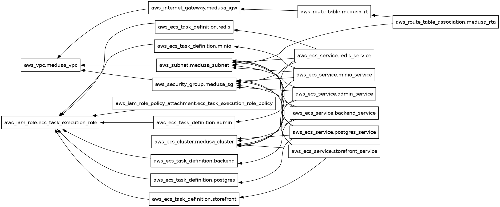

# AWS ECS Deployment with GitHub Actions for Medusa E-commerce

This project demonstrates an automated deployment pipeline for a Medusa e-commerce platform to Amazon ECS (Elastic Container Service) using GitHub Actions and Terraform. The project is based on:
- [Create an E-commerce Platform with Medusa and Docker](https://blog.openreplay.com/create-an-ecommerce-platform-with-medusa-and-docker/)
- [Medusa Docker Example](https://github.com/Prn-Ice/medusa-docker)

## Architecture

Below is the architecture diagram showing how the components interact:

## Overview

The pipeline automatically deploys a containerized Medusa e-commerce application to AWS ECS when changes are pushed to the main branch. It uses:

- GitHub Actions for CI/CD automation
- Terraform for infrastructure as code
- AWS ECS for container orchestration
- AWS ECR for storing Medusa container images
- Medusa - Headless e-commerce platform
- Docker for containerization

## Workflow

The deployment workflow (.github/workflows/ecs-deploy.yml) performs the following steps:

1. Checks out the code repository
2. Configures AWS credentials
3. Sets up Terraform
4. Initializes Terraform configuration
5. Plans the infrastructure changes
6. Applies the changes to AWS infrastructure

## Prerequisites

To use this pipeline, you need:

- An AWS account
- AWS credentials (access key and secret key) stored as GitHub secrets:
  - `AWS_ACCESS_KEY_ID`
  - `AWS_SECRET_ACCESS_KEY`
- Terraform configuration files defining your ECS infrastructure
- Access to AWS ECR repository to store container images
- Docker installed locally for testing
- Node.js and PostgreSQL for local Medusa development

## Security

Sensitive credentials are stored as GitHub secrets and securely injected into the workflow at runtime.
